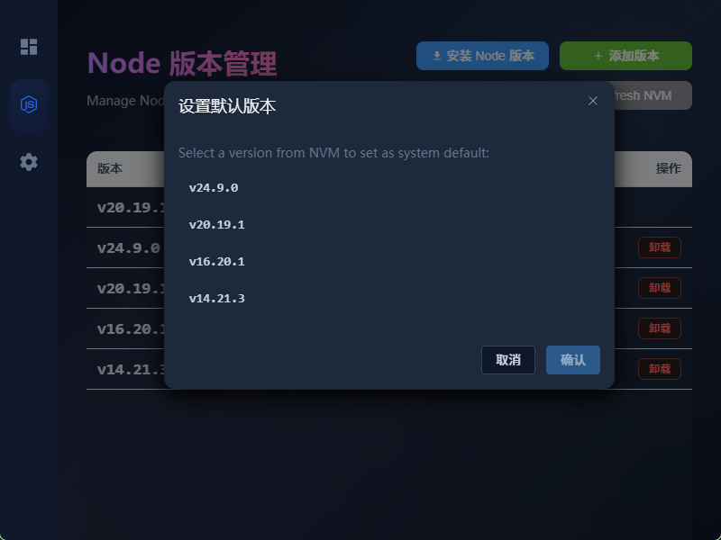
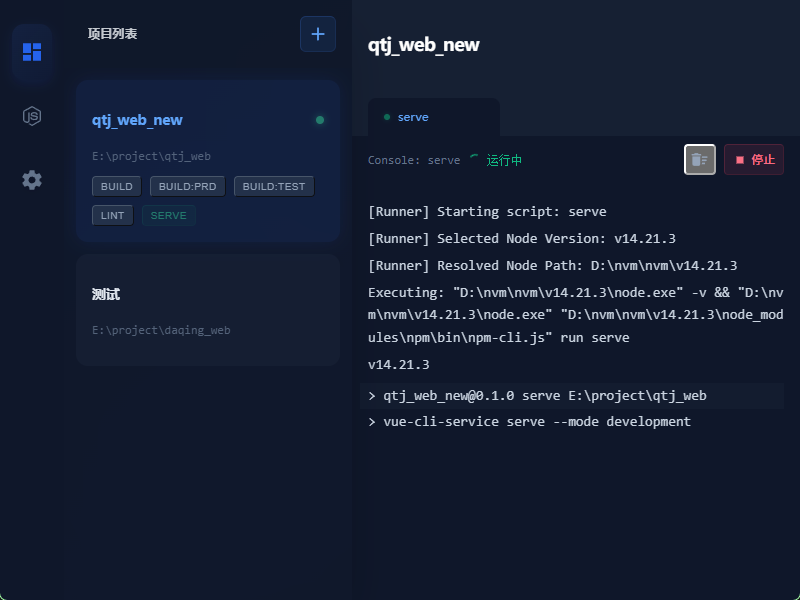
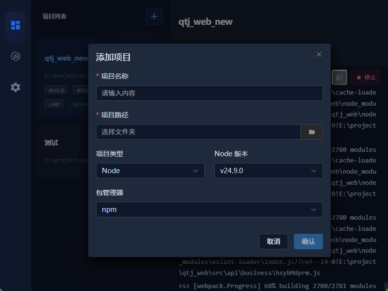
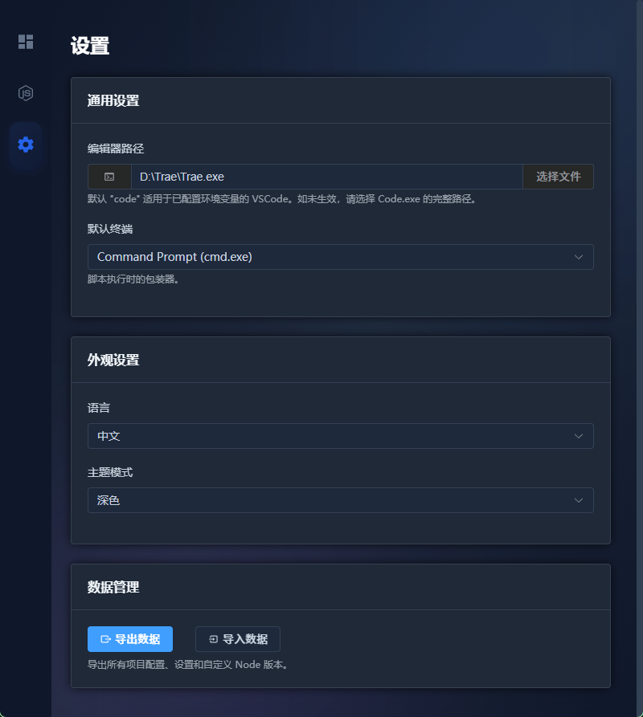

# 前端项目管理器 (Frontend Project Manager)

一个现代化的跨平台桌面应用，用于管理前端项目和 Node.js 版本。基于 Tauri + Vue 3 + TypeScript 构建。

## 功能特性

### Node 版本管理
可视化管理 NVM 版本。轻松安装、卸载和切换 Node.js 版本，告别繁琐的命令行。

一键设置系统默认 Node.js 版本，自动配置环境变量，解决版本切换不生效的问题。

### 项目管理
统一管理所有前端项目。直接在界面上运行 `npm` 脚本（如 `dev`, `build`），查看运行日志。

通过选择文件夹轻松添加项目。应用会自动识别 `package.json` 中的脚本命令。

### 设置与个性化
自定义您的使用体验：
- **主题**：深色 / 浅色 / 跟随系统
- **语言**：简体中文 / English
- **编辑器**：配置您喜欢的编辑器（如 VS Code），一键打开项目。
- **终端**：支持选择 CMD、PowerShell 或 Git Bash 作为默认终端。

## 技术栈

- **核心**：Tauri v2, Rust
- **前端**：Vue 3, TypeScript, Vite
- **UI**：Element Plus, Tailwind CSS (UnoCSS)
- **状态管理**：Pinia

## 快速开始

1. 克隆仓库。
2. 安装依赖：`npm install`。
3. 运行开发服务器：`npm run tauri dev`。
4. 构建生产版本：`npm run tauri build`。

## 开源协议

MIT
